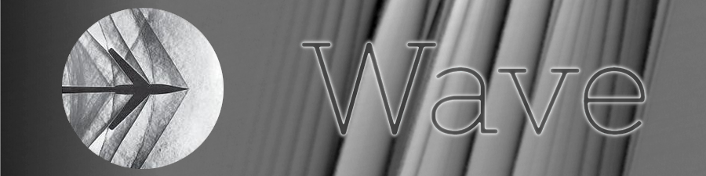

by Giacomo Guidotto

---

Wave is a full-stack messaging application realized following
the [REST API philosophy](https://restfulapi.net/).  
This project is a frontend implementation: a
[Typescript](https://www.typescriptlang.org/) based
[Next.js](https://nextjs.org/) application with
[Redux](https://redux.js.org/) for state management and
[Prisma ORM](https://www.prisma.io/) for data caching, styled with the
[Tailwind](https://tailwindcss.com/) framework.

---

> ### Warning: Work in Progress
> This project is still under development. Lots of features are missing. In
> particular, the Prisma ORM is still an idea as it might not even be the right
> choice for this work.  
> The main priority was to offer a solid structure that efficiently fits all the
> different parts at work together and to create a responsive and friendly
> user experience with fundamental accessibility features like theming and
> internationalization.

## Discover the [Wave backend](https://github.com/GiacomoGuidotto/Wave.Server)
